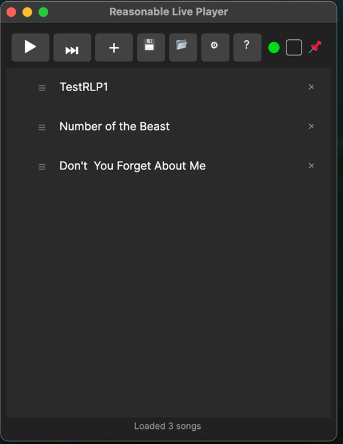

# Reasonable Live Player — macOS

An [Avalonia UI](https://avaloniaui.net/) port of [Reasonable Live Player](https://github.com/t8bloom1/ReasonableLivePlayer) for macOS.

Reasonable Live Player automates live set playback in [Reason](https://www.reasonstudios.com/). It opens Reason song files in sequence and advances to the next song when a MIDI trigger note is received — hands-free transitions for live performance.

> Looking for the Windows version? See [ReasonableLivePlayer](https://github.com/t8bloom1/ReasonableLivePlayer).



## Features

- Build and save playlists of `.reason` / `.rns` song files
- Drag and drop files from Finder into the playlist
- Reorder songs by dragging within the list
- Advance to the next song automatically via a MIDI trigger note
- Skip, pause, and resume the playlist at any time
- Select the next song to play while paused
- Configurable MIDI device, channel, and trigger note
- Configurable transition delay between songs
- Always-on-top mode for live use
- Remembers your last playlist on startup

## System Requirements

| Requirement | Details |
|---|---|
| **Operating System** | macOS 13 (Ventura) or later |
| **Reason** | Reason 13 (or later) installed |
| **Virtual MIDI Driver** | macOS IAC Driver (built-in) — see setup below |
| **Accessibility Permission** | Required — RLP uses System Events to close Reason song windows |

### Why Accessibility permission?

RLP uses macOS System Events (AppleScript) to close the current Reason song window before opening the next one. This requires Accessibility permission, which macOS will prompt you to grant on first launch.

### Virtual MIDI setup (IAC Driver)

macOS includes a built-in virtual MIDI driver — no third-party software needed:

1. Open **Audio MIDI Setup** (in `/Applications/Utilities/`).
2. From the menu bar, choose **Window → Show MIDI Studio**.
3. Double-click **IAC Driver**.
4. Check **Device is online**.
5. Click **Apply**, then close.

The IAC Driver now appears as a MIDI device in both Reason and RLP.

## Installation

1. Download the `.app` bundle from the [Releases](https://github.com/t8bloom1/ReasonableLivePlayer-Mac/releases) page (when available).
2. Move it to `/Applications` or wherever you prefer.
3. On first launch, macOS may show a security warning — right-click the app and choose **Open** to bypass Gatekeeper.
4. Grant Accessibility permission when prompted (System Settings → Privacy & Security → Accessibility).

## Quick Start

1. Open RLP and click **＋** (or drag `.reason` files from Finder) to build your playlist.
2. Click **⚙** (Settings) and select your virtual MIDI device (e.g. "IAC Driver"), channel, and trigger note number.
3. The MIDI indicator dot turns **green** when connected.
4. Press **▶** to start — RLP opens the first song in Reason.
5. When Reason plays the trigger note, RLP closes the current song and opens the next one.

## Setting Up Reason Songs

Each song in your set needs a small bit of setup so it can tell RLP when to advance. This is done using Reason's **External MIDI Instrument** device.

### Step-by-step

1. **Create an External MIDI Instrument device** — in Reason's rack, right-click and choose *Create > Players > External MIDI Instrument*.
2. **Configure its MIDI output** — set the MIDI Output to your virtual MIDI device (e.g. "IAC Driver") and the channel to match RLP Settings (default: channel 1).
3. **Add a trigger note in the sequencer** — at the point where you want RLP to advance (typically the very end), draw a single note matching the trigger note number in RLP Settings (default: C0 / note 0).
4. **Test it** — start RLP with at least two songs and press ▶. When the song reaches the trigger note, RLP should close it and open the next.

## Toolbar Reference

| Button | Action |
|---|---|
| ▶ / ⏸ | Play or pause the playlist |
| ⏭ | Skip to the next song |
| ＋ | Add `.reason` / `.rns` files |
| 💾 | Save playlist (`.rlp`) |
| 📂 | Open a saved playlist |
| ⚙ | Settings (MIDI device, channel, note, transition delay) |
| 📌 | Toggle always-on-top |
| ? | Help |

## Building from Source

Requires [.NET 8 SDK](https://dotnet.microsoft.com/en-us/download/dotnet/8.0) installed on macOS.

```bash
git clone https://github.com/t8bloom1/ReasonableLivePlayer-Mac.git
cd ReasonableLivePlayer-Mac

# Build the .app bundle
chmod +x build-mac.sh
./build-mac.sh

# Run tests
dotnet test ReasonableLivePlayer.Tests/ReasonableLivePlayer.Tests.csproj
```

The `.app` bundle will be created in the project root.

## Differences from the Windows Version

| | Windows | macOS |
|---|---|---|
| UI Framework | WPF | Avalonia UI |
| MIDI Library | winmm.dll (P/Invoke) | managed-midi |
| Virtual MIDI | LoopBe1 (third-party) | IAC Driver (built-in) |
| Window Management | Win32 API | AppleScript via System Events |
| Song Close | `SendMessage` / `PostMessage` | `osascript` (File → Close) |
| Accessibility | Not required | Required for System Events |

## License

This project is licensed under the [MIT License](LICENSE).
